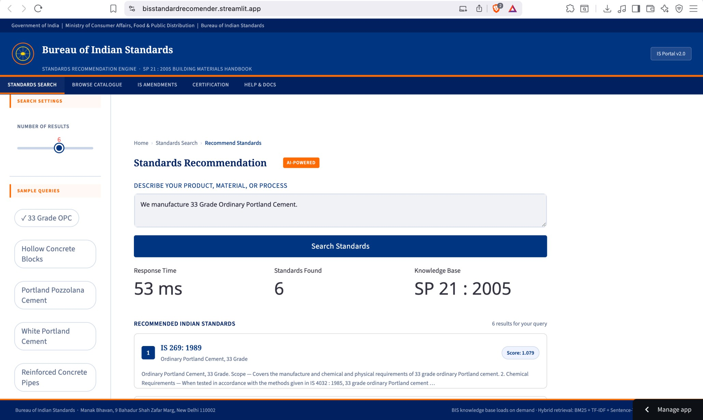

# 🏗️ BIS Standards Recommendation Engine

<p align="center">
  <b>AI-powered system to instantly recommend BIS standards from natural language queries</b><br/>
  Built for <b>Bureau of Indian Standards × Sigma Squad AI Hackathon</b>
</p>

<p align="center">
  
  
  
  
  
</p>



---

## 🚀 Run This Project (2-Min Setup)

# 💻 Local Setup

Run the BIS Standards Recommendation Engine locally in under **2 minutes**.

---

## ⚠️ Prerequisites

| Tool   | Version                             | Why                             |
| ------ | ----------------------------------- | ------------------------------- |
| Python | **3.11+ recommended** (3.10+ works) | Required for torch + embeddings |
| pip    | Latest                              | Install dependencies            |
| OS     | macOS / Linux / WSL / Windows       | Fully supported                 |
| RAM    | ≥ 2 GB free                         | Model + index (~250 MB)         |
| Disk   | ~500 MB                             | Dependencies + cache            |

👉 Check Python version:

```bash id="checkpy"
python --version
```

---

## 🚀 Setup Steps

### 1. Clone the Repository

```bash id="clonecmd"
git clone https://github.com/thehimez/BIS-Standards-Recommendation-Engine.git
cd BIS-Standards-Recommendation-Engine
```

---

### 2. Create Virtual Environment

```bash id="venvcreate"
python -m venv .venv
```

Activate:

**Mac/Linux**

```bash id="activateunix"
source .venv/bin/activate
```

**Windows**

```bash id="activatewin"
.venv\Scripts\activate
```

---

### 3. Install Dependencies (CPU optimized)

```bash id="installcmd"
pip install --upgrade pip
pip install -r requirements.txt --extra-index-url https://download.pytorch.org/whl/cpu
```

---

### 4. First-Time Setup (IMPORTANT)

```bash id="buildcmd"
python -c "from src.rag_pipeline import BISRAGPipeline; BISRAGPipeline().load()"
```

👉 This step:

* Downloads embedding model (~90MB)
* Builds FAISS index
* Takes ~60–90 seconds (one-time)

---

### 5. Run the Web App

```bash id="runapp"
streamlit run app.py
```

---

### 6. Open in Browser

http://localhost:8501

---

## ⚡ First Run Behavior

* Initial setup: **~60–90 seconds**
* After that:

  * Startup: < 2 seconds
  * Query latency: ~30 ms

---

## 🧪 Run Inference (Hackathon Format)

```bash id="infercmd"
python inference.py --input data/public_test_set.json --output public_results.json
```

---

## 📊 Evaluate Results

```bash id="evalcmd"
python eval_script.py --results public_results.json
```

---

## ⚠️ Troubleshooting

| Issue                | Cause                   | Fix                      |
| -------------------- | ----------------------- | ------------------------ |
| python3.11 not found | Not installed           | Use `python` instead     |
| torch not installed  | Missing CPU index       | Re-run install step      |
| First run slow       | Model downloading       | Normal, wait once        |
| No space left        | Torch is large (~200MB) | Free disk space          |
| Streamlit blank page | Browser issue           | Disable extensions       |
| Port already in use  | Another app running     | Use `--server.port 8502` |

---

## 💡 Pro Tip

If setup fails, try:

```bash id="fallback"
python -m pip install -r requirements.txt
```

---

## 🌐 Live Demo (No Setup Needed)

https://bisstandardrecomender.streamlit.app/

---

## 🎯 What This Project Does

Finding the correct BIS standard can take **2–6 weeks**.

This system reduces it to **milliseconds**.

👉 Input:
"33 Grade Ordinary Portland Cement"

👉 Output:
Top relevant BIS standards (IS 269:1989 + others) with rationale

---

## 🧠 How It Works

### Hybrid Retrieval Engine

* BM25 (keyword precision)
* TF-IDF (term importance)
* SBERT embeddings (semantic understanding)
* Keyword boost (IS number matching)

### Smart Chunking

* 556 standards extracted from BIS SP 21
* Each chunk = one complete standard

### Fast Retrieval

* FAISS + BM25 indexing
* ~30ms response time

---

## 📊 Performance

| Metric      | Result |
| ----------- | ------ |
| Hit Rate @3 | 100%   |
| MRR @5      | 0.783  |
| Avg Latency | ~30 ms |

---

## 🛠️ Tech Stack

* Python
* Streamlit
* FAISS
* Sentence Transformers (SBERT)
* BM25 (rank_bm25)
* scikit-learn
* PyMuPDF

---

## 📁 Project Structure

```
bis-rag/
├── app.py
├── inference.py
├── eval_script.py
├── requirements.txt
├── src/
├── data/
└── .cache/
```

---

## ▶️ Run Evaluation (Optional)

```bash
python inference.py --input data/public_test_set.json --output results.json
python eval_script.py --results results.json
```

---

## 💡 Why This Matters

* Eliminates weeks of compliance research
* Reduces dependency on consultants
* Scalable to 19,000+ BIS standards
* Enables self-serve compliance for MSMEs

---

## 🏆 Hackathon Context

* Problem: BIS standard discovery
* Constraint: <5 sec latency
* Achieved: ~30 ms ⚡

---

## 👤 Author

Himesh Bhowmik
Built end-to-end during hackathon

---

## ⭐ If you found this useful, consider starring the repo!
